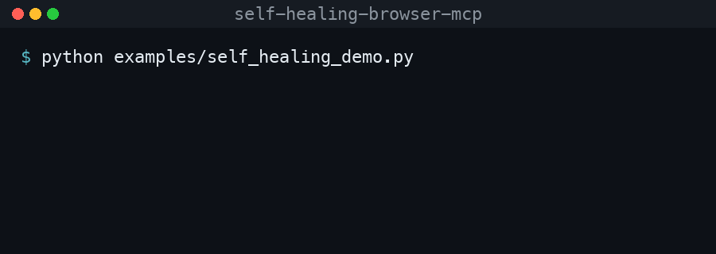

# self-healing-browser-mcp

[](https://github.com/RAJUSHANIGARAPU/self-healing-browser-mcp/actions/workflows/ci.yml)
[](LICENSE)


An **[MCP](https://modelcontextprotocol.io) server** that hands an AI agent — Claude Desktop, Claude Code, Cursor, or anything that speaks MCP — a real browser to drive, with **self-healing locators**.

<p align="center">
  
</p>

## Why

The moment you let an agent automate a browser, brittle selectors bite: a `data-testid` gets renamed, the DOM is restructured, a button's markup changes — and the run dies on a `locator not found`. Agents burn tokens retrying, or just give up.

This server takes a different contract. You describe an element by **whatever you know** — a test id, a role + accessible name, a label, some text, a CSS selector — and it resolves the element using the most stable strategy that still works. If your *preferred* locator has drifted, it **heals to a fallback and tells you so**, instead of failing.

## How the self-healing works

Each element tool accepts the same optional strategies. The resolver tries them in priority order and uses the first that matches **exactly one visible element**:

```
testid  →  role + name  →  label  →  placeholder  →  text  →  css  →  fuzzy (accessible-name match)
```

- If your first-choice strategy resolves the element, great — no heal.
- If it doesn't (renamed test id, changed structure) but a later strategy does, the result is flagged **`healed`** so you know the locator drifted and should be updated.
- If only a name is known and its casing/wording shifted, a final **fuzzy** pass matches the accessible name across interactive roles.

The agent "sees" the page semantically via `browser_snapshot` (roles + accessible names from the accessibility tree), not raw HTML or screenshots.

## Demo

See it heal live — the *same* locator hint keeps working after a refactor deletes the element's `data-testid` ([`examples/self_healing_demo.py`](examples/self_healing_demo.py)):

```console
$ python examples/self_healing_demo.py
1) Original app — the preferred data-testid resolves the button:
   -> resolved via 'testid'   healed=False

2) After a refactor removed the data-testid — SAME hint, no code change:
   -> resolved via 'role'       healed=True
   -> clicked the recovered element successfully
```

The `data-testid` the agent learned is gone, but because the hint also carried the button's role and accessible name, the engine recovered the element, flagged the heal, and the element stayed clickable — no test edit, no agent retry loop.

## Tools

| Tool | What it does |
|------|--------------|
| `browser_navigate(url)` | Open a URL in the shared page |
| `browser_snapshot()` | List interactive elements as `{role, name}` |
| `browser_click(...)` | Click an element (self-healing) |
| `browser_fill(value, ...)` | Type into a field (self-healing) |
| `browser_get_text(...)` | Read an element's text |
| `browser_assert_visible(...)` | Assert an element is visible — `PASS`/`FAIL` |
| `browser_close()` | Close the browser |

The `...` on element tools is the locator strategy set: `testid`, `role`, `name`, `label`, `placeholder`, `text`, `css` — all optional; pass as many as you know.

## Install

Not on PyPI yet, so `pip install self-healing-browser-mcp` will not find it. Install from
source into a virtual environment, then download the Chromium build Playwright drives:

```bash
python3 -m venv .venv
.venv/bin/pip install "git+https://github.com/RAJUSHANIGARAPU/self-healing-browser-mcp"
.venv/bin/python -m playwright install chromium
```

Or from a clone (editable, for development):

```bash
git clone https://github.com/RAJUSHANIGARAPU/self-healing-browser-mcp
cd self-healing-browser-mcp
python3 -m venv .venv
.venv/bin/pip install -e .
.venv/bin/python -m playwright install chromium
```

Either way, the server executable is `.venv/bin/self-healing-browser-mcp` (on Windows,
`.venv\Scripts\self-healing-browser-mcp.exe`). It is only on your `PATH` while that venv is
active, and MCP clients do not activate it, so point the client at the **full path**.

## Use it from an MCP client

**Option A — the venv you installed into.** Replace `/abs/path/to/.venv` with the real path.

Claude Code:

```bash
claude mcp add self-healing-browser -- /abs/path/to/.venv/bin/self-healing-browser-mcp
```

Claude Desktop / Cursor (MCP servers config):

```json
{
  "mcpServers": {
    "self-healing-browser": {
      "command": "/abs/path/to/.venv/bin/self-healing-browser-mcp"
    }
  }
}
```

**Option B — no venv, with [`uv`](https://docs.astral.sh/uv/).** `uvx` builds the package from
GitHub into a cached environment and runs it. Download Chromium once with the same
Playwright version:

```bash
uvx --from git+https://github.com/RAJUSHANIGARAPU/self-healing-browser-mcp playwright install chromium
```

```json
{
  "mcpServers": {
    "self-healing-browser": {
      "command": "uvx",
      "args": [
        "--from",
        "git+https://github.com/RAJUSHANIGARAPU/self-healing-browser-mcp",
        "self-healing-browser-mcp"
      ]
    }
  }
}
```

The first launch downloads dependencies, so the client's first connection can take a few
seconds longer.

Then ask your agent to, e.g., *"open example.com, snapshot the page, and click the Sign in button."* When a selector has drifted, the tool result will say it healed.

### Configuration

| Env var | Default | Purpose |
|---------|---------|---------|
| `SHBM_TESTID_ATTR` | `data-testid` | The attribute `testid` maps to (e.g. `data-test`, `data-cy`) |
| `SHBM_HEADED` | _(unset)_ | Set to `1` to watch the browser instead of running headless |

## How this differs from Microsoft's Playwright MCP

[`microsoft/playwright-mcp`](https://github.com/microsoft/playwright-mcp) is the official,
much broader server. Both drive Playwright and both let the agent read the page as an
accessibility snapshot rather than screenshots. The differences:

| | This server | Microsoft's Playwright MCP |
|---|---|---|
| Targeting an element | Each element tool takes several optional hints (`testid`, `role` + `name`, `label`, `placeholder`, `text`, `css`) and falls back through them in order, then a fuzzy name match. A fallback is reported as `healed`. | Each element tool takes one `target`: "an exact target element reference from the page snapshot, or a unique element selector". Its README documents no fallback between strategies. |
| Scope | 7 tools: navigate, snapshot, click, fill, get text, assert visible, close. | Around 70 tools, including tabs, network, storage, DevTools, and opt-in coordinate-based vision tools. |
| Browsers | Chromium only. | Chrome, Firefox, WebKit and Edge (`--browser`). |
| Runtime | Python 3.10+. | Node.js 18+ (`npx @playwright/mcp@latest`). |
| Default mode | Headless (`SHBM_HEADED=1` to watch). | Headed (`--headless` to hide). |

Both let you change the test-id attribute (`SHBM_TESTID_ATTR` here, `--test-id-attribute`
there). If you need multiple browsers, tabs, network control or screenshots, use
Microsoft's server. This one is for the narrower case where an agent reuses locators
across runs and you want them to survive markup changes and tell you when they drifted.

## Develop

```bash
pip install -e ".[dev]"
python -m playwright install chromium
pytest
```

The self-healing engine (`src/self_healing_browser_mcp/engine.py`) is decoupled from the MCP layer and tested deterministically against in-memory HTML — no external site, no flakiness.

## Releasing

Publishing to PyPI is automated with GitHub Actions via
[PyPI Trusted Publishing](https://docs.pypi.org/trusted-publishers/) (OIDC) — no API
token is stored in the repo. Every push builds and `twine check`s the distribution in
CI, so `main` is always release-ready.

To cut a release:

1. **One-time:** on PyPI, create the `self-healing-browser-mcp` project's Trusted
   Publisher pointing at this repo, workflow `publish.yml`, and environment `pypi`.
2. Bump `version` in `pyproject.toml`, commit, and tag (`git tag v0.1.1 && git push --tags`).
3. Publish a GitHub Release for that tag — the `Publish to PyPI` workflow builds and
   uploads automatically. After that, `pip install self-healing-browser-mcp` works.

No release has been published yet, so the package is not on PyPI.

## License

MIT — see [LICENSE](LICENSE).
